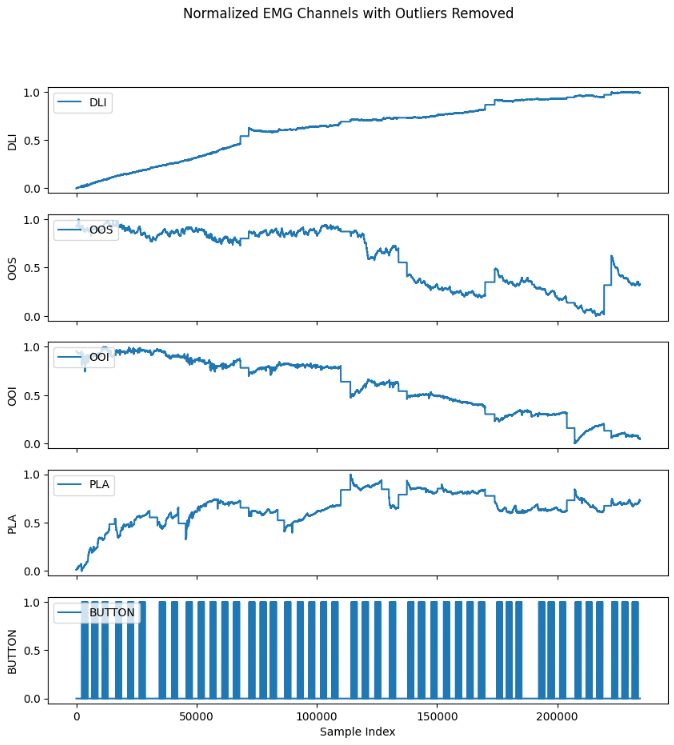

# NeuroTechSC - Data Processing and Machine Learning

This is the Git repository for the Data Processing and Machine Learning team of the NeuroTechSC organization. The main goal of our project is to detect (subvocal) phonemes from surface electromyography (sEMG) data using a Deep Neural Network model implemented in Python. This repository provides the Python notebooks for the sEMG data preprocessing and various model trainings, as well as other related data/picture/model directories.

## <u>Contents</u>

- [General Research Abstract for Project](#research-abstract)
- [Machine Learning Plan Overview](#ml-plan-overview)
- [Project Timeline](#project-timeline)
- [File Descriptions](#file-descriptions)
- [Data Processing Notebook Overview](#data-processing-pipeline)
- [Data Processing Results and Analysis](#data-processing-results)
- [Machine Learning Notebook Overview](#lstm-rnn-model)
- [Machine Learning Results and Analysis](#machine-learning-results)

## <a id="research-abstract" style="color: inherit; text-decoration: none;"><u>General Research Abstract for Project</u></a>

Subvocalization refers to the internal speech that occurs while reading or thinking without producing any audible sound. It is accompanied by the activation of the muscles involved in speech production, generating electrical signals known as electromyograms (EMGs). These signals can potentially be used for silent communication and assistive technologies, improving the lives of people with speech impairments and enabling new forms of human-computer interaction. However, the accurate recognition of subvocal EMGs remains a challenge due to the variability in signal patterns and electrode placement. Our proposed solution is to develop an advanced subvocal EMG recognition system using machine learning techniques. By analyzing the EMG signals, our system will be able to identify the intended speech content and convert it into text. This technology will be applicable in various fields, including silent communication for military or emergency personnel, assistive devices for people with speech impairments, and hands-free control of computers and other electronic devices.

## <a id="ml-plan-overview" style="color: inherit; text-decoration: none;"><u>Machine Learning Plan Overview (Original)</u></a>

This project aims to improve the performance of subvocal phoneme detection using machine learning techniques. Subvocal phonemes are the speech components generated when a person talks to themselves without producing any sound. Detecting these phonemes has various applications, including silent communication devices and assistive technologies for individuals with speech impairments.

The TMC-ViT model used in this repository is a novel deep learning architecture that leverages the benefits of vision transformers and temporal multi-channel features to achieve improved performance on sEMG data. This model outperforms conventional methods such as CNNs and LSTMs in subvocal phoneme detection tasks. 

We will first train our model on data where the phonemes are audible and voiced, then transition to whispered, and eventually we hope to be able to detect subvocal speech (like in reading or intense thought).

### **Machine Learning Update I**

Now using a LSTM/RNN model for phoneme recognition instead of the TMC-ViT, check `gtp_convos/gpt_convo_2.md` for more information. Replaced `TMC-ViT.ipynb` with `LSTM_RNN_bviou.ipynb`.

### **Machine Learning Update II**

Expanded from initial five phonemes `bviou` to a diverse set of 22. Improved data processing and precision, increased model size and robustness, and added guards against overfitting.

### **Machine Learning Update III**

Recorded complementary set of phonemes (last 22), changed muscle groups, greatly improved data quality! Accounted for more robust/diverse silence/rest class in processing, upped model parameter count, got great performance. Added model performance analysis section to data processing notebook (see `LSTM_RNN_last_22.ipynb`).

### **Machine Learning Update IV**

Had great session to collect diverse set of recordings with new muscle groups: Depressor labii inferioris (DLI), Orbicularis oris superior (OOS), Orbicularis oris inferior (OOI), and the Platysma (PLA)

- all 44 phonemes, each said 10 times (`data/chris_final/data_all44.csv`)
- 10 test words broken into syllables (`data/chris_final/test_sentences/vocal_test_words.csv`)
- 10 test sentences (`data/chris_final/test_sentences/vocal_test_sentences.csv`)
- ABCs vocal/whispered (`data/chris_final/ABCs/vocal_and_whispered_ABCs.csv`)
- ABCs silent (`data/chris_final/ABCs/silent_ABCs.csv`)
- Research Abstract vocal/whispered (`data/chris_final/research_abstract/vocal_and_whispered_research_abstract.csv`)
- Research Abstract silent (`data/chris_final/research_abstract/silent_research_abstract.csv`)

### **Machine Learning Update V - Final**

After extensive research and experimentation, we've come to the following conclusions:

- It is very difficult to classify subvocal phonemes using a model trained on vocalized phonemes. Possible solutions include transfer learning or massive amounts of subvocal data.
- The method in which we collected data (individual phoneme pronunciations for simplicity, which eliminated the need for manual data labeling) does not carry over well to detecting phonemes within smooth/continuous 
conversation and word vocalization. Ideally data should consist of words/phrases/text being vocalized/whispered/subvocalized, and then labeling each segment with the proper phoneme/
- Muscle group choices/electrode placement greatly impacts the quality of data, more channels would definitely help the model's performance, and a mask to hold the electrodes in place reliably would decrease outlier spikes, improving data quality.
- Normalization method is very important to consider, we used min-max normalization based on the entire recording to generate training examples for our models, but didn't consider that the live application would receive data as a stream, therefore not really matching the method used in training (bad for accuracy). Experimented with normalizing within each segment (which could be done with a stream) rather than over the entire recording, retrained the model, but this resulted in a complete failure to improve, with several possible contributing reasons. 
- Need a lot lot more data to build something useful.

## <a id="project-timeline" style="color: inherit; text-decoration: none;"><u>Project Timeline</u></a>

1. Came up with a design plan and chose model architecture (TMC-ViT) - `early 2023`
2. Collected data for 5 phonemes - `2023/04/19`
3. Finished preprocessing data (see `EMG_Data_Processing_bviuo.ipynb`) - `2023/04/24`
4. Analyzed data and presented findings at the California Neurotech Conference on April 29th, 2023 (see Research Abstract section)
5. Assessed model viability and are considering a pivot from TMC-ViT to an LSTM/RNN network - `2023/05/14`
6. Created training examples with various hyperparameters (see `data/`)
7. Pivoted to LSTM/RNN architecture, achieved near 100% accuracy on test data with ~155,000 parameters (see `archive/LSTM_RNN_bviou.ipynb`)
8. Expanded from initial five phonemes `bviou` to a diverse set of 22, attempted recording with 7 channels/muscle groups (attempt failed, only 3 usable channels) - `2023/05/28`
9. Processed data and modified model hyperparameters to scale to more classes, achieved ~99% accuracy on test data with ~836,000 parameters (see `LSTM_RNN_first_22.ipynb`)
10. Collected data for remaining 22 phonemes, used 4 new muscle groups/channels, quality recordings got processed into super clean data (see `archive/Emg_Data_Processing_last_22.ipynb`) - `2023/06/08` 
11. Trained model which achieved ~98.3% accuracy on test data (window=10) with 1,373,591 parameters
12. Trained model which achieved ~99.0% accuracy on test data (window=5) with 1,369,751 parameters (see `archive/LSTM_RNN_last_22.ipynb`)
13. Recorded diverse set of sEMG data (see `data/chris_final/`) with 4 new muscle groups - `2023/06/09`
14. Made training example sets with window sizes 5, 10, and 30 (see `Data_Processing_Final.ipynb`) - `2023/06/15`
15. Trained various models, experimented with hyperparameters and network architectures
16. Achieved ~98.1% accuracy on test data (window=5) with 223,533 parameters
17. Assessed and examined data processing methods - `2023/06/22`
18. Experimented with different data processing methods, no promising results
19. Combined the model with a multi-threaded python program to predict phonemes in real time (see `live_app/`) - `2023/06/25`
20. Collaborated with club members to record final project presentation for the NTX Student Club Competition 2023 - `2023/06/27`

### **Next Steps**

Many many possible next steps: 
- Get more and better data
- Figure out best data processing/training example generation methods
- Improve model architecture/hyperparameters
- Get the live app working
- Build a better, FPGA-based hardware board for data collection
- 3D-print a mask to keep electrode placement consistent.

## <a id="file-descriptions" style="color: inherit; text-decoration: none;"><u>File Descriptions</u></a>

- `Project_Methods.png` - image showing history of recording sessions 
- `git_push_script.bat` - batch script to quickly push all changes to the repository with a commit message
- `archive/` - folder which contains old model training and data processing notebooks
- `data/` - folder which contains the raw .csv files from the recordings, as well as formatted training example/label .npy files
- `gtp_convos/` - discussions with GPT-4 about the project
- `models/` - folder which contains saved models, not just weights
- `pictures/` - folder which contains pictures for the README.md
- `reports/` - folder which contains markdown reports of the Notebooks for data processing and machine learning results and analysis

## <a id="data-processing-pipeline" style="color: inherit; text-decoration: none;"><u>Data Processing Notebook Overview</u></a>

This notebook outlines a complete data pipeline for pre-processing, visualizing, and segmenting raw Electromyography (EMG) data with the purpose of generating training data for a Machine Learning model. 

### **Structure of the Notebook**

1. **Import Libraries**: Necessary libraries for data processing and visualization are imported at this step.

2. **Set Hyperparameters**: Hyperparameters for segmentation are set. Also, the list of phonemes and silence is initialized.

3. **Define Functions**: The notebook defines a few functions which will be used for data processing and visualization.

4. **Load Data**: Raw data is loaded from a CSV file into a pandas DataFrame.

5. **Preprocess Data**: The data is preprocessed which includes filtering relevant columns, and replacing timestamps based on the recording frequency.

6. **Plot Raw EMG Channels**: The raw EMG channels are plotted using the defined function.

7. **Outlier Removal and Data Normalization**: The outliers from the data are removed, and then it's normalized. After normalization, the "BUTTON" values are rounded to 0 or 1, and a new DataFrame `df_normalized` is created.

8. **Add Rolling Max Column**: The DataFrame `df_normalized` is modified by adding a new column which represents the rolling maximum of "BUTTON".

9. **Identify Segments**: Segments are identified with 1s in the rolling maximum of "BUTTON".

10. **Separate Segments**: The identified segments are then separated into different phoneme groupings.

11. **Plot and Calculate Segment Statistics**: The segments are plotted and statistical analysis is performed.

12. **Clean DataFrame**: Unnecessary columns from the DataFrame are dropped to clean the data.

13. **Create Silent Segments**: Silent segments are created by picking an area with no recording/EMG activation.

14. **Segment Data**: Actual dataframes are split into the segment chunks and stored in a dictionary.

15. **Generate Training Examples/Labels**: Multiple training examples are created from each segment using a sliding window technique. Then, corresponding y_train array is created.

16. **Create Filename**: Filenames are created based on the set hyperparameters.

17. **Save Files**: Finally, the training examples and their corresponding labels are saved in `.npy` files.

The outcome of this notebook is a set of files containing preprocessed, segmented, and labeled training data ready for use in training a Machine Learning model.

## <a id="data-processing-results" style="color: inherit; text-decoration: none;"><u>Data Processing Results and Analysis</u></a>

### **Normalized Data**

### **Hyperparameter Choices**
| Hyperparameter | Value     |
|----------------|-----------|
| PHONEMES       | _, B, D, F, G, HH, JH, K, L, M, N, P, R, S, T, V, W, Y, Z, CH, SH, NG, DH, TH, ZH, WH, AA, AI(R), I(R), A(R), ER, EY, IY, AY, OW, UW, AE, EH, IH, AO, AH, UH, OO, AW, OY |
| CHANNELS       | 4         |
| WINDOW_SIZE    | 5         |
| STEP_SIZE      | 5         |

### **Hyperparameter Methodology**

#### **Phonemes**
We used the 44 phonemes/diacritics defined by the International Phonetic Alphabet (IPA).

#### **Channels**
There are 4 channels for 4 muscle groups: depressor labii inferioris (DLI), orbicularis oris superior (OOS), orbicularis oris inferior (OOI), and the platysma (PLA).

#### **Window Size and Step Size**
To make the most of the available data, we experimented with creating datasets with various values of window size and step size, ranging from 5-30. We settled on 5 and 5 (meaning 20ms windows with no overlap), as this combination provides the following benefits:

1. **More training examples:** By breaking down the available data into smaller units, we can increase the number of training examples that are created from the same dataset.
2. **Faster model response time:** Using smaller window size and step size datasets allows the ML model to have a quicker response time when it is integrated into a real-time application.

### **Phoneme Recordings**
| Statistic                     | Value     |
|-------------------------------|-----------|
| Number of segments            | 440       |
| Average segment length (values)| 37.5     |
| Minimum segment length (values)| 19       |
| Maximum segment length (values)| 66       |
| Standard Deviation of segment length (values)| 8.36 |
| Average segment length (ms)   | 150.01    |
| Minimum segment length (ms)   | 76        |
| Maximum segment length (ms)   | 264       |
| Standard Deviation of segment length (ms) | 33.46|

### **Data Issues**

The dataset contains 440 recordings in total, which is not ideal for training a robust machine learning model, and the distribution of phoneme training examples is not uniform, some phonemes have more representation than others. It is important to note that the actual recordings included in the dataset are longer than necessary for an effective ML model. However, with the chosen window size and step size, we can create more training examples to train a better, more reactive and robust model.

### **Training Example Generation**
| Phoneme       | Examples   |
|---------------|------------|
| silence       | 100        |
| B             | 59         |
| D             | 60         |
| F             | 100        |
| G             | 66         |
| HH            | 84         |
| JH            | 69         |
| K             | 62         |
| L             | 89         |
| M             | 91         |
| N             | 90         |
| P             | 70         |
| R             | 59         |
| S             | 81         |
| T             | 54         |
| V             | 94         |
| W             | 66         |
| Y             | 57         |
| Z             | 95         |
| CH            | 64         |
| SH            | 70         |
| NG            | 89         |
| DH            | 94         |
| TH            | 103        |
| ZH            | 99         |
| WH            | 65         |
| AA            | 59         |
| AI(R)         | 55         |
| I(R)          | 59         |
| A(R)          | 68         |
| ER            | 70         |
| EY            | 59         |
| IY            | 67         |
| AY            | 65         |
| OW            | 65         |
| UW            | 56         |
| AE            | 64         |
| EH            | 62         |
| IH            | 60         |
| AO            | 62         |
| AH            | 62         |
| UH            | 63         |
| OO            | 71         |
| AW            | 64         |
| OY            | 59         |

### **Final Training Data**
| Python Code              | Shape                 |
|--------------------------|-----------------------|
| X_train.shape            | (3220, 4, 5)          |
| y_train.shape            | (3220,)               |

### **Conclusion**

We have processed and analyzed our data of the selected 44 phonemes, gaining insight into the recording sessions and informing future decisions. Despite the limitations in data quality and quantity, the analysis and data processing approach enabled us to create a dataset suitable for a machine learning model.

## <a id="lstm-rnn-model" style="color: inherit; text-decoration: none;"><u>Machine Learning Notebook Overview</u></a>

### **Structure of the Notebook**

1. **Import Libraries**: Necessary libraries for data processing, model building, and visualization are imported. These include os, re, random, numpy, tensorflow, keras, scikit-learn, matplotlib, seaborn.

2. **Set Hyperparameters and Filenames**: The hyperparameters of the dataset, including phonemes and classes are defined. Training data is loaded and filenames are parsed.

3. **Parse Filename**: A function is defined to parse filenames of the dataset using regular expressions.

4. **Train/Test Split**: The loaded training data is split into training and testing sets using a test size of 20%. The data is then reshaped to fit into the neural network model.

5. **Original/Training/Test Set Distributions - OPTIONAL**: Provides information about training example distributions across phonemes/classes.

6. **Define the Model**: A sequential model is defined using layers such as Conv1D, Dropout, LSTM, and Dense. The model is then compiled with the loss function, optimizer, and metrics.

7. **Define Early Stopping Callback**: An EarlyStopping callback function is defined to monitor the model's performance on the validation set and prevent overfitting.

8. **Train the Model**: The model is fit on the training data, validated on the testing data using the early stopping callback, and trained over 2000 epochs.

9. **Evaluate the Model**: The trained model is evaluated on the test set. The test loss and test accuracy are computed and displayed.

10. **Plotting Training and Validation Loss and Accuracy**: Graphs representing the training and validation loss, as well as training and validation accuracy are generated.

11. **Calculate and Display Confusion Matrix**: The model's performance is further evaluated by predicting the classes for the entire test set and generating a confusion matrix.

12. **Test Model on Random Examples**: The model's performance is demonstrated by predicting phonemes for a random selection of examples from the test set and comparing them to the actual phonemes.

13. **Save Model**: The trained model, along with its weights and hyperparameters, is saved for future use.

## <a id="machine-learning-results" style="color: inherit; text-decoration: none;"><u>Machine Learning Results and Analysis</u></a>

### **Train and Test Shapes**
| Python Code              | Shape             |
|--------------------------|-------------------|
| X_train.shape            | (3220, 4, 5)      |
| y_train.shape            | (3220,)           |

### **Data Preparation and Considerations**

We prepared the dataset using an 80/20 split, which resulted in an appropriate total count and phoneme distribution for both the training and test sets. It is important to take into consideration the fact that using a sliding window technique has generated training examples that may be adjacent and/or from the same phoneme recording that end up in both the training and test set, which could lead to data leakage. The choice of parameters, 5 and 5 (20 ms), was intentional, in order to have zero overlap while also creating enough training examples that could be used to make a real-time transcription model.

### **Model Summary**
Model: "sequential_4"  
Total params: 223,533
| Layer (type)                | Output Shape       | Param Count   |
|-----------------------------|--------------------|---------------|
| conv1d_7 (Conv1D)           | (None, 4, 256)     | 4096          |
| dropout_14 (Dropout)        | (None, 4, 256)     | 0             |
| lstm_6 (LSTM)               | (None, 128)        | 197120        |
| dropout_15 (Dropout)        | (None, 128)        | 0             |
| dense_9 (Dense)             | (None, 128)        | 16512         |
| dense_10 (Dense)            | (None, 45)         | 5805          |

### **Evaluation Results on X_test**
| Evaluation Statistic        | Value                           |
|-----------------------------|---------------------------------|
| Test Example Count          | 644                             |
| Test Loss                   | 0.11591044068336487             |
| Test Accuracy               | 0.9813664555549622 (632/644)    |

### **Evaluation Conclusions**

These results demonstrate that the model effectively recognizes phonemes with high accuracy while exhibiting low loss levels. However, the model might be overfitting considering the limited data and quick achievement of 95%+ accuracy. 

### **Loss Graph**

### **Accuracy Graph**

### **Graph Evaluation**

The graphs demonstrate some spikes in loss/accuracy but overall seem stable and normal. Something interesting of note is that training accuracy is lower than validation accuracy, which seems counterintuitive; after some research and experimentation, we determined the cause to be the dropout layers, which are only active during training, thereby reducing performance/accuracy on the training set vs validation set.

### **Confusion Matrix**

### **Confusion Matrix Evaluation**

The model provided promising results, with only a few misclassified phonemes in the entire test set. Ensuring high-quality recordings might help to improve the overall performance of the model.