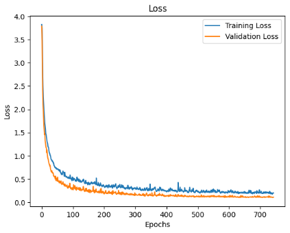

# NeuroTechSC - Machine Learning

This is the Git repository for the Machine Learning team of the NeuroTechSC organization. The main goal of our project is to detect subvocal phonemes from surface Electromyography (sEMG) data using a Deep Neural Network model implemented in Python. This repository provides the Python notebooks for the sEMG data preprocessing and various model trainings.

## General Research Abstract for Project

Subvocalization refers to the internal speech that occurs while reading or thinking without producing any audible sound. It is accompanied by the activation of the muscles involved in speech production, generating electrical signals known as electromyograms (EMGs). These signals can potentially be used for silent communication and assistive technologies, improving the lives of people with speech impairments and enabling new forms of human-computer interaction. However, the accurate recognition of subvocal EMGs remains a challenge due to the variability in signal patterns and electrode placement. Our proposed solution is to develop an advanced subvocal EMG recognition system using machine learning techniques. By analyzing the EMG signals, our system will be able to identify the intended speech content and convert it into text. This technology will be applicable in various fields, including silent communication for military or emergency personnel, assistive devices for people with speech impairments, and hands-free control of computers and other electronic devices.

## Machine Learning Plan Overview (Original)

This project aims to improve the performance of subvocal phoneme detection using machine learning techniques. Subvocal phonemes are the speech components generated when a person talks to themselves without producing any sound. Detecting these phonemes has various applications, including silent communication devices and assistive technologies for individuals with speech impairments.

The TMC-ViT model used in this repository is a novel deep learning architecture that leverages the benefits of vision transformers and temporal multi-channel features to achieve improved performance on sEMG data. This model outperforms conventional methods such as CNNs and LSTMs in subvocal phoneme detection tasks. 

## Machine Learning Plan Amendment

Now using a LSTM/RNN model for phoneme recognition instead of the TMC-ViT, check `gtp_convos/gpt_convo_2.md` for more information. Replaced `TMC-ViT.ipynb` with `LSTM_RNN.ipynb`.

## Project Timeline

1. Came up with a design plan and chose model architecture (TMC-ViT)
2. Collected data for 5 phonemes
3. Finished preprocessing data
4. Analyzed data and presented findings at the California Neurotech Conference on April 29th, 2023 (see Research Abstract section)
5. Assessed model viability and are considering a pivot from TMC-ViT to an LSTM/RNN network
6. Created training examples with various hyperparameters (see `data/`)
7. Pivoted to LSTM/RNN architecture, achieved near 100% accuracy on test data with ~155,000 parameters (see `LSTM_RNN.ipynb`)

### Next Steps

1. Collect data on more phonemes, upgrade Cyton OpenBCI board to support 7 muscle groups instead of 4
3. Assess the viability of a second model to correct phoneme/letter-level errors (phoneme list to word string model)
4. Build a real-time transcription app

## File Descriptions

- `LSTM_RNN.ipynb` - a model that reached ~100% test accuracy on our 5 phonemes, has training code + visualization
- `EMG_Data_Processing.ipynb` - preprocessing script that cleans the data and formats it into training examples
- `gtp_convos/gpt_convo.md` - a discussion on processing .adc files and modifying TMC-ViT code
- `gtp_convos/gpt_convo_2.md` - a discussion on using transformer and RNN architectures for subvocal phoneme prediction
- `data/` - folder which contains the raw .csv files from the recordings, as well as formatted example/label .npy files

## EMG_Data_Processing.ipynb

1. Import the necessary libraries, such as numpy, pandas, matplotlib.pyplot, random, and os.

2. Set hyperparameters for phonemes, channels, size, and step.

3. Define a function plot_all_channels that takes a DataFrame and a title as inputs. It creates a figure with subplots for each channel.

4. Load and preprocess the CSV data into a Pandas DataFrame, skipping the first few lines of metadata, and rename the columns by removing leading spaces.

5. Plot the raw "EXG" channels using the plot_all_channels function.

6. Normalize the data using Min-Max normalization, round "EXG Channel 4" values to 0 or 1, and create a new DataFrame df_normalized.

7. Add a new column to the DataFrame for the rolling maximum of "EXG Channel 4" (initial window size of 90).

8. Define plot_rolling_channel_4 and segment_stats functions for plotting the rolling maximum of "EXG Channel 4" with different ranges and calculating statistics about the segments.

9. Identify the start and end indices of segments with 1s in the rolling maximum of "EXG Channel 4".

10. Plot and analyze different segments of the data using the plot_rolling_channel_4 and segment_stats functions.

11. Generate training examples for each phoneme, such as train_silence, train_b, train_v, train_i, train_u, and train_o, using the generate_training_examples function.

12. Concatenate the training arrays, create the X_train array and print its shape.

13. Generate training labels for each phoneme, such as y_train_silence, y_train_b, y_train_v, y_train_i, y_train_u, and y_train_o, using the np.full function.

14. Concatenate the training labels and create the y_train array. Print its shape.

15. Save the X_train and y_train arrays as NumPy files with an appropriate filename format.

The script processes the EMG data, normalizes it, segments it, generates training examples, and saves the resulting data for further use.

## Data Processing Results and Analysis
### Hyperparameter Choices
| Hyperparameter | Value     |
|----------------|-----------|
| PHONEMES       | 'bviuo'   |
| CHANNELS       | 4         |
| SIZE           | 10        |
| STEP           | 5         |

### Hyperparameter Methodology
#### Phonemes
There are 5 phonemes (and a silence class): /b, /v, /i, /u, /o, chosen for their EMG signal differences and muscle group activations.

#### Channels
There are 4 channels for 4 muscle groups: zygomaticus major (ZYG), orbicularis oris superior (OOS), orbicularis oris inferior (OOI), risorius	(RIS)

#### Size and Step
To make the most of the available data, we created datasets with varying sizes and steps. These ranged from larger size/step combinations (100, 100) to smaller ones (10, 5). In our analysis, we opted for the smaller size/step combination, as it provides the following benefits:

1. **More training examples:** By breaking down the available data into smaller units, we can increase the number of training examples that are created from the same dataset.
2. **Faster model response time:** Using smaller size/step datasets allows the ML model to have a quicker response time when it is integrated into a real-time application.  

### Phoneme Recordings
| Statistic                     | b         | v         | i         | u         | o         | total       |
|-------------------------------|-----------|-----------|-----------|-----------|-----------|-----------|
| Number of segments            | 9         | 11        | 11        | 11        | 11         | 53        |
| Average segment length (values)| 211.11    | 333.36    | 311.00    | 297.00    | 295.36    | 292.53    |
| Minimum segment length (values)| 102       | 304       | 241       | 237       | 266       | 102       |
| Maximum segment length (values)| 303       | 375       | 362       | 321       | 326       | 375       |
| Average segment length (ms)   | 844.33    | 1355.0    | 1252.0    | 1185.09   | 1182.09   | 1175.75   |
| Minimum segment length (ms)   | 407.0     | 1216.0    | 962.0     | 938.0     | 1061.0    | 407.0     |
| Maximum segment length (ms)   | 1208.0    | 1495.0    | 1444.0    | 1280.0    | 1301.0    | 1495.0    |

### Data Issues

The dataset contains only 53 recordings in total, which is not ideal for training a robust machine learning model. This limitation is particularly pronounced for the /b phoneme, which is represented by only 9 recordings. The reduced data quality is a result of issues during the data collection process.

### Training Example Generation
| Class                    | Count     |
|--------------------------|-----------|
| train_silence (0)           | 649       |
| train_b (1)                 | 367       |
| train_v (2)                 | 718       |
| train_i (3)                 | 669       |
| train_u (4)                 | 638       |
| train_o (5)                 | 635       |

### Training Data Considerations

It is important to note that the actual recordings included in the dataset are much longer than necessary for an effective ML model. However, by generating smaller training example segments, we can still derive useful insights and train a competent model.

### Final Training Data
| Python Code              | Shape             |
|--------------------------|-------------------|
| X_train.shape            | (3676, 4, 10)     |
| y_train.shape            | (3676,)           |

### Conclusion

Despite the limitations in data quality and quantity, we have analyzed the available phoneme recordings and optimized the data processing approach to create a useful dataset for machine learning applications. This analysis will guide the development of a model that provides sufficient performance, given the constraints of the data.

## LSTM_RNN.ipynb

1. Import the required libraries and modules for data manipulation, machine learning and plotting (Numpy, TensorFlow, Keras, Scikit-learn, Matplotlib, Seaborn).

2. Define the phonemes to be used for classification, and read the input data files (X_filename and y_filename) from the specified directory.

3. Define and implement a function to parse the filename for retrieving the number of examples, channels, and size of input data.

4. Load the training data (X_train_og, y_train_og) and split it into training (X_train, y_train) and test (X_test, y_test) datasets using Scikit-learn's train_test_split function.

5. Prepare the data by re-shaping the input tensors to have size (N, CHANNELS, SIZE).

6. Count the occurrences of each class in the original, training, and test sets; print the phoneme counts.

7. Define a deep learning model with multiple layers (Conv1D, LSTM, Dense) using TensorFlow and Keras.

8. Compile the model using the 'sparse_categorical_crossentropy' loss, 'adam' optimizer, and 'accuracy' metric.

9. Define an Early Stopping callback to monitor the 'val_accuracy' with a patience value of 100.

10. Train the model using the fit function with the training and validation data, batch size of 128, and up to 500 epochs (initially).

11. Evaluate the model performance on the test set and print the test loss and accuracy scores.

12. Plot the training and validation loss, and training and validation accuracy, over time (epochs).

13. Display the confusion matrix using a heatmap, which compares the actual and predicted phonemes for the test dataset.

14. Choose 10 random examples from the test set and predict the phoneme using the trained model. Compare the actual and predicted phonemes for these examples.

## Machine Learning Results
### Train and Test Shapes
| Python Code              | Shape             |
|--------------------------|-------------------|
| X_train.shape            | (2940, 4, 10)     |
| X_test.shape             | (736, 4, 10)      |

### Phoneme Example Distribution
| Set                   | _       | b      | v      | i      | u      | o      |
|-----------------------|---------|--------|--------|--------|--------|--------|
| Original set (%)      | 100.0%  | 100.0% | 100.0% | 100.0% | 100.0% | 100.0% |
| Original set          | 649     | 367    | 718    | 669    | 638    | 635    |
|-----------------------|---------|--------|--------|--------|--------|--------|
| Training set (%)      | 76.43%  | 82.02% | 80.08% | 81.31% | 81.98% | 78.90% |
| Training set          | 496     | 301    | 575    | 544    | 523    | 501    |
|-----------------------|---------|--------|--------|--------|--------|--------|
| Test set (%)          | 23.57%  | 17.98% | 19.92% | 18.69% | 18.02% | 21.10% |
| Test set              | 153     | 66     | 143    | 125    | 115    | 134    |

### Model Summary
Model: "sequential"  
Total params: 155,878
| Layer (type)          | Output Shape      | Param Count   |
|-----------------------|-------------------|-----------|
| conv1d (Conv1D)       | (None, 2, 32)     | 992       |
| conv1d_1 (Conv1D)     | (None, 2, 64)     | 2112      |
| lstm (LSTM)           | (None, 2, 128)    | 98816     |
| lstm_1 (LSTM)         | (None, 64)        | 49408     |
| dense (Dense)         | (None, 64)        | 4160      |
| dense_1 (Dense)       | (None, 6)         | 390       |  

### Evaluation Results on X_test
| Evaluation Statistic     | Value             |
|--------------------------|-------------------|
| Test Example Count       | 736               |
| Test Loss                | 0.015696810558    |
| Test Accuracy            | 0.997282624244    |

### Loss Graph

### Accuracy Graph

### Confusion Matrix

## Machine Learning Analysis
TBA
