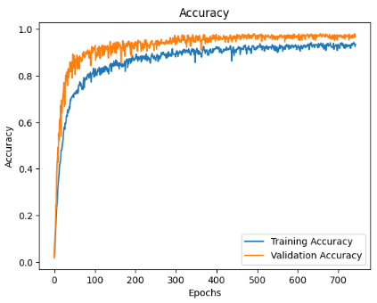

# NeuroTechSC - Machine Learning

This is the Git repository for the Machine Learning team of the NeuroTechSC organization. The main goal of our project is to detect subvocal phonemes from surface Electromyography (sEMG) data using a Deep Neural Network model implemented in Python. This repository provides the Python notebooks for the sEMG data preprocessing and various model trainings.

## <u>Contents</u>

- [General Research Abstract for Project](#research-abstract)
- [Machine Learning Plan Overview](#ml-plan-overview)
- [Project Timeline](#project-timeline)
- [File Descriptions](#file-descriptions)
- [EMG Data Processing](#emg-data-processing)
- [Data Processing Results and Analysis](#data-processing-results)
- [Machine Learning - LSTM RNN Model](#lstm-rnn-model)
- [Machine Learning Results and Analysis](#machine-learning-results)

## <a id="research-abstract" style="color: inherit; text-decoration: none;"><u>General Research Abstract for Project</u></a>

Subvocalization refers to the internal speech that occurs while reading or thinking without producing any audible sound. It is accompanied by the activation of the muscles involved in speech production, generating electrical signals known as electromyograms (EMGs). These signals can potentially be used for silent communication and assistive technologies, improving the lives of people with speech impairments and enabling new forms of human-computer interaction. However, the accurate recognition of subvocal EMGs remains a challenge due to the variability in signal patterns and electrode placement. Our proposed solution is to develop an advanced subvocal EMG recognition system using machine learning techniques. By analyzing the EMG signals, our system will be able to identify the intended speech content and convert it into text. This technology will be applicable in various fields, including silent communication for military or emergency personnel, assistive devices for people with speech impairments, and hands-free control of computers and other electronic devices.

## <a id="ml-plan-overview" style="color: inherit; text-decoration: none;"><u>Machine Learning Plan Overview (Original)</u></a>

This project aims to improve the performance of subvocal phoneme detection using machine learning techniques. Subvocal phonemes are the speech components generated when a person talks to themselves without producing any sound. Detecting these phonemes has various applications, including silent communication devices and assistive technologies for individuals with speech impairments.

The TMC-ViT model used in this repository is a novel deep learning architecture that leverages the benefits of vision transformers and temporal multi-channel features to achieve improved performance on sEMG data. This model outperforms conventional methods such as CNNs and LSTMs in subvocal phoneme detection tasks. 

### **Machine Learning Plan Amendment 1**

Now using a LSTM/RNN model for phoneme recognition instead of the TMC-ViT, check `gtp_convos/gpt_convo_2.md` for more information. Replaced `TMC-ViT.ipynb` with `LSTM_RNN_bviou.ipynb`.

### **Machine Learning Update**

Expanded from initial five phonemes `bviou` to a diverse set of 22. Improved data processing and precision, increased model size and robustness, and added guards against overfitting.

## <a id="project-timeline" style="color: inherit; text-decoration: none;"><u>Project Timeline</u></a>

1. Came up with a design plan and chose model architecture (TMC-ViT)
2. Collected data for 5 phonemes
3. Finished preprocessing data
4. Analyzed data and presented findings at the California Neurotech Conference on April 29th, 2023 (see Research Abstract section)
5. Assessed model viability and are considering a pivot from TMC-ViT to an LSTM/RNN network
6. Created training examples with various hyperparameters (see `data/`)
7. Pivoted to LSTM/RNN architecture, achieved near 100% accuracy on test data with ~155,000 parameters (see `archive/LSTM_RNN_bviou.ipynb`)
8. Expanded from initial five phonemes `bviou` to a diverse set of 22, attempted recording with 7 channels/muscle groups (attempt failed, only 3 usable channels)
9. Processed data and modified model hyperparameters to scale to more classes, achieved ~97% accuracy on test data with ~836,000 parameters (see `LSTM_RNN_first_22.ipynb`)

### **Next Steps**

1. Collect data for remaining 22 phonemes, using 3 or more channels/muscle groups
2. Re-record first 22 phonemes with any additional channels/muscle groups
3. Assess the viability of a second model to correct phoneme/letter-level errors (phoneme list to word string model?)
4. Build a real-time transcription app

## <a id="file-descriptions" style="color: inherit; text-decoration: none;"><u>File Descriptions</u></a>

- `LSTM_RNN_first_22.ipynb` - a model that reached ~97% test accuracy on 22 diverse phonemes, has training code + visualization
- `EMG_Data_Processing_first_22.ipynb` - preprocessing script that cleans the data and formats it into training examples
- `Project_Methods.png` - image showing history of recording sessions 
- `data/` - folder which contains the raw .csv files from the recordings, as well as formatted example/label .npy files
- `archive/` - folder which contains old model training and data processing notebooks
- `pictures/` - folder which contains pictures for the README.md
- `gtp_convos/` - discussions with GPT-4 about the project

## <a id="emg-data-processing" style="color: inherit; text-decoration: none;"><u>EMG Data Processing</u></a>

1. Import Libraries
    - Import necessary libraries for data processing and visualization (numpy, pandas, matplotlib).

2. Set Hyperparameters
    - Define the hyperparameters of the dataset, including phonemes, channels, window size, and step size.

3. Define `plot_all_channels` function
    - Create a function that takes a DataFrame and title as inputs and plots a figure with subplots for each channel.

4. Load and Preprocess Data
    - Load the CSV data into a Pandas DataFrame.
    - Filter out unnecessary columns and assign new column names.
    - Remove the first 4000 rows due to bad data.

5. Plot Raw EMG Channels
    - Plot raw EMG channels using the `plot_all_channels` function.

6. Data Normalization and Outliers Removal
    - Normalize the data using Min-Max normalization and round the values to 0 or 1.
    - Create a new DataFrame `df_normalized`.
    - Remove outliers by replacing them with the mean of surrounding values.

7. Define `plot_rolling_channel_4` and `segment_stats` Functions
    - Create functions for plotting the rolling maximum of EXG Channel 4 with different ranges and for calculating statistics about the segments.

8. Add Rolling Max Column
    - Add a new column for the rolling maximum of EXG Channel 4 with a specific window size.

9. Identify Segments
    - Identify the start and end indices of segments with 1s in the rolling maximum of EXG Channel 4.
    - Get segments that need to be zeroed and filter out small segments.

10. Clean Recordings and Group Segments
    - Define functions to clean the data, group the segments, and create a dictionary with separated phonemes.

11. Generate Training Examples and Labels
    - Create functions to generate training examples and labels, concatenate them into arrays, and save them as numpy files.

## <a id="data-processing-results" style="color: inherit; text-decoration: none;"><u>Data Processing Results and Analysis</u></a>
### **Hyperparameter Choices**
| Hyperparameter | Value     |
|----------------|-----------|
| PHONEMES       | /_, /p, /b, /t, /d, /k, /g, /f, /v, /s, /z, /m, /i, /ē, /e, /a, /u, /oo, /ū, /a(r), /ā, /ī, /oy |
| CHANNELS       | 3         |
| WINDOW_SIZE    | 10        |
| STEP_SIZE      | 10         |

### **Hyperparameter Methodology**
#### **Phonemes**
There are 22 phonemes (and a silence class), chosen for their EMG signal differences and muscle group activations.

#### **Channels**
There are 3 channels for 3 muscle groups: depressor labii inferioris (DLI), orbicularis oris superior (OOS), and orbicularis oris inferior (OOI). Attempt at recording with 7 channels failed, recorded with 4, had to get rid of the zygomaticus major (ZYG) channel because of electorode connection problems. (Less channels than for 5 phoneme model)

#### **Window Size and Step Size**
To make the most of the available data, we experimented with creating datasets with various values of window size and step size, ranging from 10-50 and 1-50 respectively. We settled on 10 and 10 (meaning 40ms windows with no overlap), as this combination provides the following benefits:

1. **More training examples:** By breaking down the available data into smaller units, we can increase the number of training examples that are created from the same dataset.
2. **Faster model response time:** Using smaller window size and step size datasets allows the ML model to have a quicker response time when it is integrated into a real-time application.

### **Phoneme Recordings**
| Statistic                     | Value    |
|-------------------------------|-----------|
| Number of segments            | 231      |
| Average segment length (values)| 97.2     |
| Minimum segment length (values)| 50       |
| Maximum segment length (values)| 207      |
| Average segment length (ms)   | 388.81   |
| Minimum segment length (ms)   | 200      |
| Maximum segment length (ms)   | 828      |

### **Data Issues**

The dataset contains only 231 recordings in total, which is not ideal for training a robust machine learning model, and the distribution of phoneme training examples is not uniform, some phonemes have more representation than others. This limitation is a result of issues during the data collection process. It is important to note that the actual recordings included in the dataset are much longer than necessary for an effective ML model. However, with the chosen window size and step size, we can create more training examples to train a better and more robust model.

### **Training Example Generation**
| Phoneme       | Examples   |
|---------------|------------|
| silence       | 100        |
| p             | 148        |
| b             | 64         |
| t             | 94         |
| d             | 80         |
| k             | 69         |
| g             | 95         |
| f             | 85         |
| v             | 90         |
| s             | 91         |
| z             | 114        |
| m             | 122        |
| i             | 91         |
| ē             | 103        |
| e             | 90         |
| a             | 102        |
| u             | 104        |
| oo            | 119        |
| ū             | 82         |
| a(r)          | 97         |
| ā             | 81         |
| ī             | 99         |
| oy            | 122        |

### **Final Training Data**
| Python Code              | Shape                 |
|--------------------------|-----------------------|
| X_train.shape            | (2242, 3, 10)         |
| y_train.shape            | (2242,)               |

### **Conclusion**

We have processed and analyzed the dataset of 22 phonemes, highlighting their various articulatory features and EMG signal differences. Despite the limitations in data quality and quantity, the analysis and data processing approach enable us to create a dataset suitable for machine learning applications.

## <a id="lstm-rnn-model" style="color: inherit; text-decoration: none;"><u>Machine Learning - LSTM RNN Model</u></a>

1. Import Libraries
    - Import necessary libraries for data processing, model building, and visualization (os, re, random, numpy, tensorflow, keras, scikit-learn, matplotlib, seaborn).

2. Set Hyperparameters
    - Define the hyperparameters of the dataset, including phonemes and classes.

3. Define `get_files_with_prefix` function
    - Create a function that takes a directory and prefix as inputs and returns a list of files with the specified prefix.

4. Load and Preprocess Data
    - Load the training data and parse the filenames.
    - Split the data into training and testing sets.
    - Prepare the data for input into the model.

5. Define the Model
    - Create a sequential model using various layers such as Conv1D, Dropout, LSTM, and Dense.
    - Compile the model with loss, optimizer, and metrics.

6. Define Early Stopping callback
    - Define an EarlyStopping callback function to prevent overfitting.

7. Train the Model
    - Fit the model on the training data and validate it on the testing data using the early stopping callback.

8. Evaluate the Model
    - Evaluate the final model on the testing set and display the test accuracy.

9. Plotting Training and Validation Loss and Accuracy
    - Create plots for training and validation loss, as well as training and validation accuracy.

10. Calculate and Display Confusion Matrix
    - Get the predicted classes for the entire test set.
    - Create and display the confusion matrix using a heatmap.

11. Test Model on Random Examples
    - Choose random examples from the test set and display their actual and predicted phonemes.

## <a id="machine-learning-results" style="color: inherit; text-decoration: none;"><u>Machine Learning Results and Analysis</u></a>
### **Train and Test Shapes**
| Python Code              | Shape             |
|--------------------------|-------------------|
| X_train.shape            | (1793, 3, 10)     |
| X_test.shape             | (449, 3, 10)      |

### **Data Preparation**

We prepared the dataset using an 80/20 split, which resulted in an appropriate total count and phoneme distribution for both the training and test sets.

### **Model Summary**
Model: "sequential_6"  
Total params: 837,783
| Layer (type)                | Output Shape       | Param Count   |
|-----------------------------|--------------------|---------------|
| conv1d_12 (Conv1D)          | (None, 3, 128)     | 3968          |
| batch_normalization_8       | (None, 3, 128)     | 512           |
| dropout_8 (Dropout)         | (None, 3, 128)     | 0             |
| conv1d_13 (Conv1D)          | (None, 2, 256)     | 98560         |
| batch_normalization_9       | (None, 2, 256)     | 1024          |
| dropout_9 (Dropout)         | (None, 2, 256)     | 0             |
| lstm_12 (LSTM)              | (None, 2, 256)     | 525312        |
| batch_normalization_10      | (None, 2, 256)     | 1024          |
| dropout_10 (Dropout)        | (None, 2, 256)     | 0             |
| lstm_13 (LSTM)              | (None, 256)        | 525312        |
| batch_normalization_11      | (None, 256)        | 1024          |
| dropout_11 (Dropout)        | (None, 256)        | 0             |
| dense_6 (Dense)             | (None, 256)        | 65792         |
| dense_7 (Dense)             | (None, 22)         | 5657          |  

### **Evaluation Results on X_test**
| Evaluation Statistic        | Value                           |
|-----------------------------|---------------------------------|
| Test Example Count          | 449                             |
| Test Loss                   | 0.18518821895122528             |
| Test Accuracy               | 0.9710467457771301 (436/449)    |

### **Evaluation Conclusions**

These results demonstrate that the model effectively recognizes phonemes with high accuracy while exhibiting low loss levels. However, the model might be overfitting considering the limited data and quick achievement of 95%+ accuracy. For more phonemes, a larger model size could help scale the number of classes, and adding dropout layers may combat overfitting.

### **Loss Graph**

### **Accuracy Graph**

### **Graph Evaluation**

The graphs demonstrate some spikes in loss/accuracy but overall seem stable and normal.

### **Confusion Matrix**

### **Confusion Matrix Evaluation**

The model provided promising results, with only a few misclassified phonemes in the entire test set. Ensuring high-quality recordings might help to improve the overall performance of the model.
